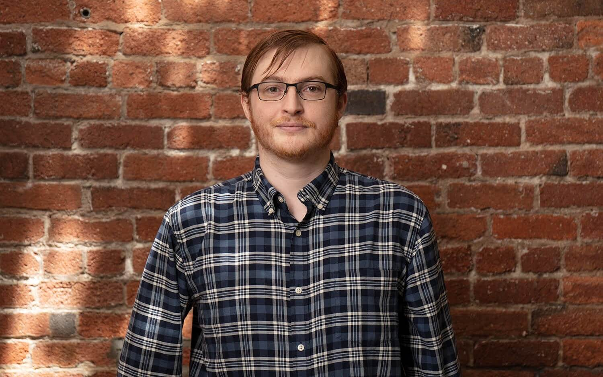
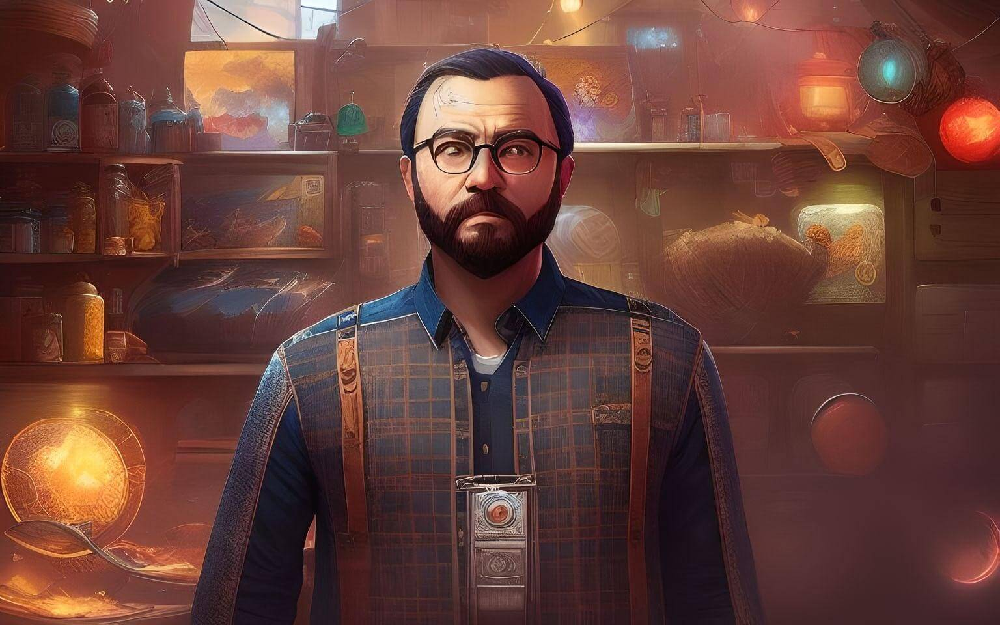
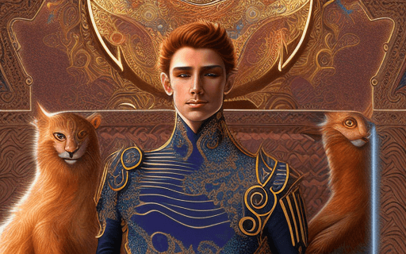
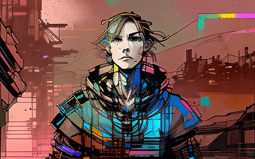
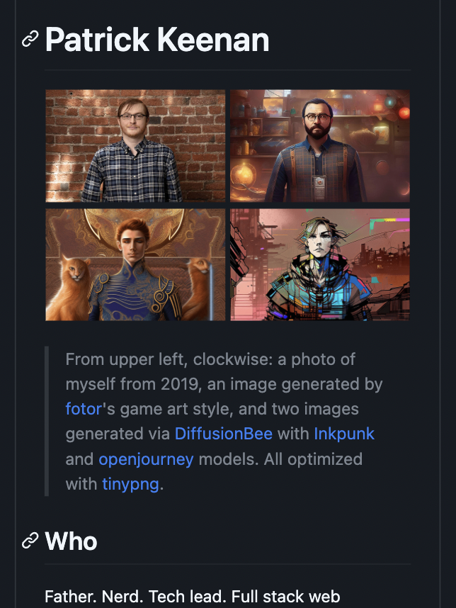
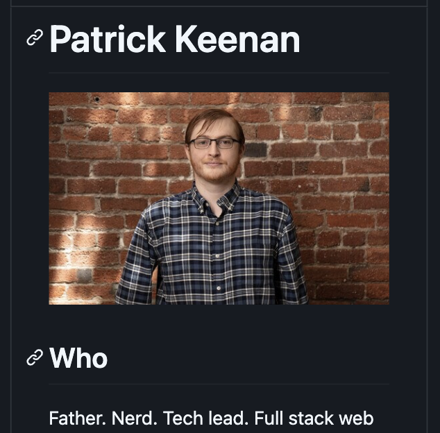

# Profile Readme Image

## Source Images

  
  
  
  

 

Show/Hide details

### Mugshot

Photographic portrait of myself taken in 2019 in San Francisco, CA at the headquarters of [Traction](https://tractionco.com/) during my first day of work there.

### Game Art

AI edit of my mugshot by [fotor](https://www.fotor.com/images/create) in their "game art style."

### Court Wizard

AI edit of my mugshot via [DiffusionBee](https://diffusionbee.com/) with [openjourney](https://huggingface.co/prompthero/openjourney) model.

> **Seed :** 49369
> 
> **Scale :** 7.58
> 
> **Steps :** 25
> 
> **Image Strength :** ~0.4
> 
> **model_version :** custom_mdjrny-v4
> 
> **Prompt :** mdjrny-v4 style, male arcane (wizard) with auburn hair, prominent (gold filigree), high contrast (art nouveau) by (terese nielsen)

### Slicer

AI edit of my mugshot via [DiffusionBee](https://diffusionbee.com/) with [Inkpunk](https://huggingface.co/Envvi/Inkpunk-Diffusion) model.

> **Seed :** 59364
> 
> **Scale :** 11.4
> 
> **Steps :** 25
> 
> **Image Strength :** ~0.4
> 
> **model_version :** custom_Inkpunk-Diffusion-v2
> 
> **Prompt :** nvinkpunk, techno-shaman surrounded by occult symbols, art nouveau, cyberpunk colors

Note that the prompt seems to have almost no effect with this model. Image strength is the most important parameter.

## Viewport Considerations

In `0.2.0` I designed a 2x2 grid of images, with the original photo in the top left and the AI edits in the other three quadrants. It was an attractive starting point, but each viewport suffered from compromises made for the others. In `0.3.0` I sought a more responsive solution despite GitHub's restrictive markdown rendering.

### Mobile / Small

#### Image Caption

In `0.2.0` the caption text which looked so good on desktop was taking up an excessive amount of vertical space on small viewports. I moved the information out of the root readme and into this document, which also provided space for elaboration on my process.

<i>Before & After</i>

The new images are wrapped in an anchor tag which points to this directory, where this readme will be surfaced in GitHub's directory UI.

#### Image Size

The individual images were too small to distinguish in small viewports, prompting me to investigate animation to create a gallery effect. I chose to use an SVG for this because I knew it was supported in the restrictive environment of GitHub markdown rendering, I wanted to know how to do it, and unlike other options it allowed me to still use my webdev skillset.

  

I learned that the source images could not easily be referenced within an SVG file (ex. `./img/foo.png` as works in Markdown files) so I instead opted to [convert the images to base64](https://www.base64-image.de/) after [shrinking the larger ones](https://www.iloveimg.com/resize-image) and rinsing them all through [tinypng](https://tinypng.com/), using the linked online service for convenience.

The result is the ~400kB file that you see above. I render this only up to 800px because the image is 512px wide and too much stretching noticeably impairs quality.

### Tablet / Medium

I suspect the most common circumstance for this viewport on GitHub is actually "half-screen desktop" and I assessed it as such.

I tried the original 2x2 style here but found on the low end of the viewport range it was running into similar issues as the small viewports where the images were too small, and on the high end was using too much vertical space compared to the new [large variant](#desktop--large). I settled on not creating a distinct Medium asset for now, instead placing a single breakpoint between small and large. This strategy also allowed me to minimize the number of assets I was signing myself up to maintain.

### Desktop / Large

I received some feedback that the original 2x2 was taking up too much space when full-screen on desktop. I investigated using a 4x1 or a right-floated 1x4 instead but each had its own issues and in both cases the images were individually too small on a laptop screen. After the successful investigation into the gallery-style SVG for small viewports, I decided to tweak that same file into a 2x1 grid with my real photo fixed on the left and the AI images cycling on the right.

  

The result is a file which is identical to the other except for tweaks to its `<style>` block - very easy to expand and maintain in the future. This approach also allowed me to leverage the `<picture>` element to serve different images based on viewport size, enabling me to solve the root problem from the `0.2.0` layout.
