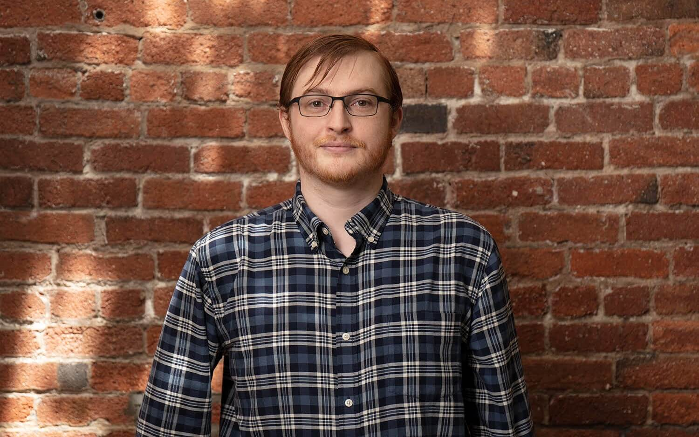
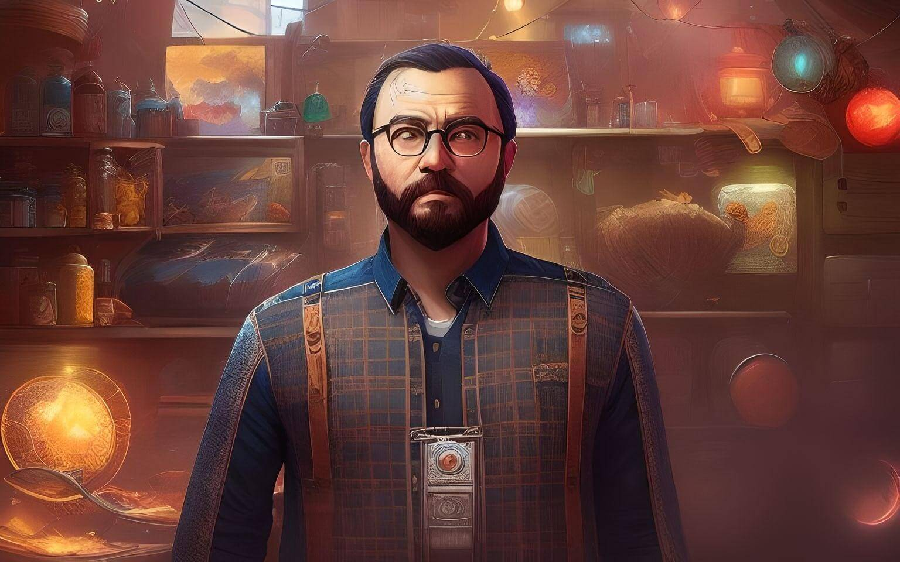
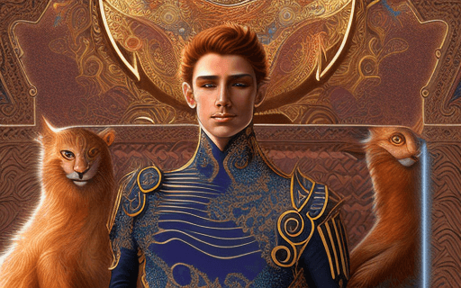
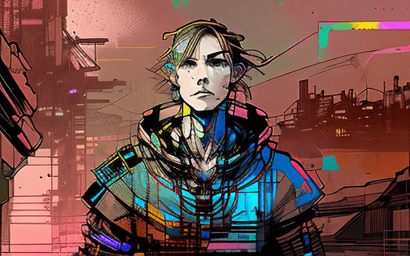

# Patrick Keenan

 
 

> From upper left, clockwise: a photo of myself from 2019, an image generated by [fotor](https://www.fotor.com/images/create)'s game art style, and two images generated via [DiffusionBee](https://diffusionbee.com/) with [Inkpunk](https://huggingface.co/Envvi/Inkpunk-Diffusion) and [openjourney](https://huggingface.co/prompthero/openjourney) models. All optimized with [tinypng](https://tinypng.com/).

